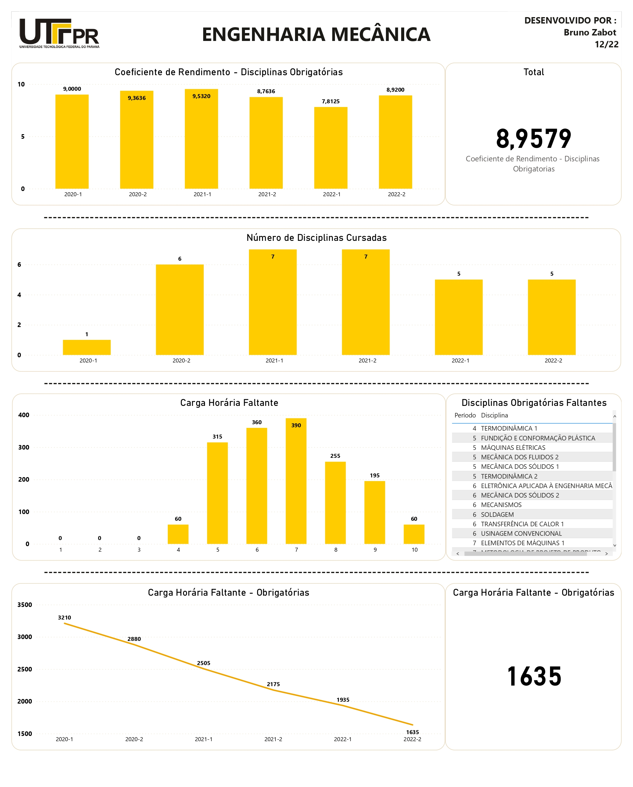

# Dashboard Controle Curso - Engenharia Mecânica

Utilizando os dados do histórico do aluno e a matriz curricular do curso foi criado um dashboard com as principais informações sobre as disciplinas obrigatórias.

#### Gráficos
O dashboard conta com quatro gráficos, sendo:
- Coeficiente de rendimento por período e total (das disciplinas obrigatórias)
- Número de disciplinas cursadas por semestre
- Carga horária faltante por período e disciplinas que ainda faltam cursar
- Carga horária faltante por semestre e carga horária faltante

#### Dashboard

